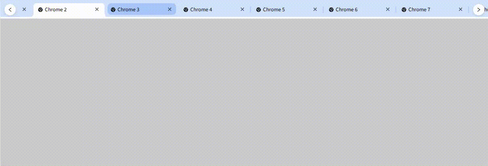

# ChromeStyleTabs 组件文档

## 组件介绍

`ChromeStyleTabs` 是 Chrome 风格标签页组件，具备标签拖拽排序、滚动导航、关闭前确认、自定义样式等核心能力;



## 依赖说明

安装命令：

```
npm install chrome-style-tabs-react --save

\# 或 yarn

yarn add chrome-style-tabs-react
```


## 使用示例

### 1. 基础用法


```ts
// import ChromeStyleTabs from "chrome-style-tabs-react";
function ChromeExample() {
    const [tabs, setTabs] = useState<ChromeStyleTabType[]>(
        new Array(15).fill(0).map((item, index) => ({
            key: "Fackbook" + index,
            label: "Fackbook " + index,
            icon: <AppleOutlined />,
            // disabled: index % 2 === 0,
        }))
    );
    const [activeKey, setActiveKey] = useState("Google");

    return (
        <div>
            <ChromeStyleTabs
                tabs={tabs}
                activeKey={activeKey}
                onClose={(tab, index, tabs) => {
                    setTabs(tabs);
                }}
                onDrag={(tabs) => {
                    setTabs(tabs);
                }}
            />
        </div>
    );
}
```


## 组件属性（Props）


| 属性名                | 类型                                                                             | 默认值    | 描述                                                              |
| ------------------ | ------------------------------------------------------------------------------ | ------ | --------------------------------------------------------------- |
| `className`        | `string`                                                                       | -      | 组件外层容器的自定义类名，用于覆盖默认样式（如背景色、边框）                                  |
| `style`            | `React.CSSProperties`                                                          | -      | 组件外层容器的内联样式，支持自定义布局（如宽度、margin、padding）                         |
| `tabs`             | `ChromeStyleTabType[]`                                                         | `[]`   | **必填项**，标签页数据源，每个元素需符合 `ChromeStyleTabType` 结构                  |
| `activeKey`        | `string \| number`                                                             | -      | 受控模式下当前激活标签的唯一标识，优先级高于 `defaultActiveKey`                       |
| `defaultActiveKey` | `string \| number`                                                             | -      | 非受控模式下的初始激活标签标识，组件内部自动管理后续激活状态                                  |
| `draggable`        | `boolean`                                                                      | `true` | 是否开启标签拖拽排序功能，`false` 时禁用拖拽                                      |
| `scrollStep`       | `number`                                                                       | `100`  | 点击左右导航按钮时的滚动距离（单位：px），负值会自动重置为 100                              |
| `onClick`          | `(tab: ChromeStyleTabType, index: number) => void`                             | -      | 标签点击事件回调，返回当前点击的标签数据（`tab`）和索引（`index`）                         |
| `onClose`          | `(tab: ChromeStyleTabType, index: number, tabs: ChromeStyleTabType[]) => void` | -      | 标签关闭事件回调，返回被关闭的标签（`tab`）、索引（`index`）及关闭后的标签列表副本（`tabs`）         |
| `onChange`         | `(key: string \| number) => void`                                              | -      | 标签激活状态切换回调，返回当前激活标签的 `key` 值                                    |
| `onDrag`           | `(tabs: ChromeStyleTabType[]) => void`                                         | -      | 标签拖拽排序完成回调，返回拖拽后的完整标签列表                                         |
| `onCloseBefore`    | `(tab: ChromeStyleTabType, index: number) => Promise<boolean>`                 | -      | 标签关闭前确认回调，返回 `Promise<boolean>`：- `true`：允许关闭标签- `false`：阻止关闭标签 |


## css var
```css
:root {
  --cst-container-bg-color: #d3e3fd;
  --cst-bottom-bar-color: #fff;
  --cst-prev-btn-color: #fff;
  --cst-next-btn-color: #fff;
  --cst-tab-bg-color: var(--cst-container-bg-color);
  --cst-split-color: #a8c7fa;
  --cst-split-opacity: 0.8;
  --cst-tab-active-color: #fff;
  --cst-tab-hover-bg-color: #a8c7fa;
  --cst-close-hover-bg-color: #93add9;
  --cst-close-active-hover-bg-color: #dcdcdd;
  --cst-prev-next-btn-shadow: 0 2px 8px #00000026;
  --cst-tab-width: initial;
  --cst-tab-min-width: initial;
  --cst-tab-max-width: initial;
}
```


## 类型定义

### 1. ChromeStyleTabType（标签数据结构）

标签数组 `tabs` 中的每个元素需符合以下结构：


```ts
interface ChromeStyleTabType {
    /**
     * @description icon
     */
    icon?: React.ReactNode;

    /**
     * @description title
     */
    label?: React.ReactNode;

    /**
     *
     * @description key
     */
    key?: string | number;

    /**
     * @description 是显示关闭按钮
     * @default true
     */
    allowClose?: boolean;

    /**
     * @description disabled
     * @default false
     */
    disabled?: boolean;
}
```

## 核心功能说明

### 1. 标签基础交互

#### （1）激活状态管理


* **受控模式**：通过 `activeKey` 传入外部状态控制激活标签，每次激活状态变化会触发 `onChange` 回调，需在外部同步状态。

  示例：


```ts
const [currentKey, setCurrentKey] = useState("1");
<ChromeStyleTabs
  tabs={tabs}
  activeKey={currentKey}
  onChange={(key) => setCurrentKey(key)}
/>
```


* **非受控模式**：仅通过 `defaultActiveKey` 设置初始激活标签，后续激活状态由组件内部管理，无需外部同步。

  示例：


```ts
<ChromeStyleTabs
  tabs={tabs}
  defaultActiveKey="1"
/>
```


* **关闭后自动激活**：关闭当前激活标签时，组件会优先激活下一个标签；若无下一个标签，则激活上一个标签；无标签时清空激活状态。

#### （2）标签关闭逻辑


* 点击标签右上角的关闭按钮触发关闭流程；

* 若配置 `onCloseBefore`，会先执行确认逻辑，根据返回的 `Promise<boolean>` 决定是否关闭；

* 关闭成功后触发 `onClose` 回调，返回关闭后的标签列表副本（不修改原数组）。

### 2. 拖拽排序功能


* **开启条件**：`draggable={true}`（默认开启）；

* **拖拽限制**：仅支持水平方向拖拽（通过 `restrictToHorizontalAxis` 修饰符实现），避免垂直方向偏移；

* **排序回调**：拖拽完成后触发 `onDrag` 回调，返回排序后的标签列表，需在外部同步更新 `tabs` 数据源以保持视图一致。

### 3. 滚动导航功能

当标签数量超出容器宽度时，自动显示左右导航按钮，支持两种滚动方式：


* **鼠标滚轮滚动**：在标签容器上滚动鼠标滚轮，标签列表随滚轮方向横向滚动；

* **导航按钮滚动**：点击左侧按钮向左滚动 `scrollStep` 像素，点击右侧按钮向右滚动 `scrollStep` 像素；

* **按钮显示逻辑**：通过 `IntersectionObserver` 监测首 / 尾标签是否在可视区域内：


  * 首标签不可见 → 显示左侧「前一个」按钮；

  * 尾标签不可见 → 显示右侧「后一个」按钮。


## 注意事项


1. **数据源唯一性**：`tabs` 数组中每个元素的 `key` 必须唯一，否则会导致标签渲染异常或拖拽排序错误；

2. **受控模式同步**：使用 `activeKey` 时，必须通过 `onChange` 同步外部状态，否则会出现 “激活状态不匹配” 问题；

3. **拖拽排序数据更新**：开启拖拽后，需在 `onDrag` 回调中同步更新 `tabs` 数据源，否则视图不会刷新排序结果；

4. **兼容性说明**：

* `IntersectionObserver` 兼容 Chrome 51+、Firefox 55+、Edge 15+、Safari 12.1+，IE 不支持，需兼容 IE 时可引入 [polyfill](https://github.com/w3c/IntersectionObserver/tree/main/polyfill)；

* DnD-Kit 依赖现代浏览器特性，不建议在 IE 中使用；

1. **性能优化**：当标签数量较多（如超过 20 个）时，建议通过 `React.memo` 优化 `TabItem` 子组件，避免不必要的重渲染。

## 常见问题（FAQ）

### Q1：标签关闭后，激活状态没有自动切换？

A1：检查是否同时设置了 `activeKey` 和 `defaultActiveKey`，若使用受控模式（`activeKey`），需在 `onClose` 回调中手动更新 `activeKey` 状态，组件不会自动修改外部传入的 `activeKey`。

### Q2：拖拽标签后，视图没有更新排序结果？

A2：确保在 `onDrag` 回调中同步更新了 `tabs` 数据源，拖拽仅触发排序逻辑，不会自动修改原数组，需手动更新 `tabs` 以刷新视图。

### Q3：左右导航按钮没有显示？

A3：检查以下两点：


1. 标签数量是否超出容器宽度（若标签较少，无需滚动，按钮会自动隐藏）；

2. 是否正确引入 `PrevSvg` 和 `NextSvg` 组件，按钮依赖这两个 SVG 图标渲染。

### Q4：`onCloseBefore` 没有触发？

A4：确认 `onCloseBefore` 是返回 `Promise<boolean>` 的函数，而非普通函数 
